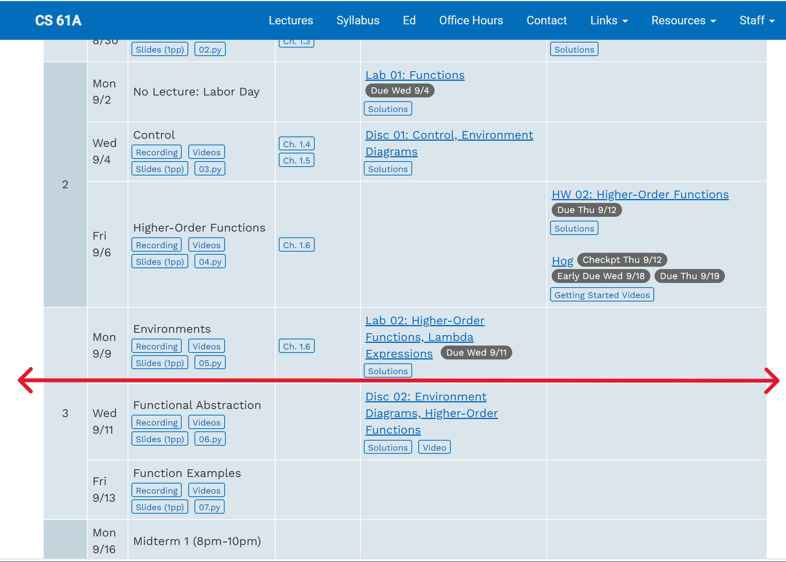

# CS61A
正如前面所说的那样，CS61A是一门必修课程。他将极大的弥补你在校内学习的过程中，对于编程逻辑的不足。并且会以一种新的角度来看待 programming的过程。

**学习时间**：***最开始学习*** / 建议在假期和学习[Developing Software Introduction-HP1R_47](https://cn.sqa.org.uk/files/SQA-Advanced/Computing_Software_Development/Computing_Software_Units/HP1R47.pdf)课程的同时

## 课程链接
* [网站](https://insideempire.github.io/CS61A-Website-Archive/index.html)
* [代码](https://github.com/InsideEmpire/CS61A-Assignments)

## 不足之处
纵使这门课程给初学者带来了很大帮助，但是一个不容忽视的问题是他与国内的[Developing Software Introduction-HP1R_47](https://cn.sqa.org.uk/files/SQA-Advanced/Computing_Software_Development/Computing_Software_Units/HP1R47.pdf)的契合度很差。

针对国内课程来讲，由于C++和python的规范不同，导致很容易在二者的使用中产生混淆。如果害怕发生以上问题，请参考以下课程规划：

以24Fall大纲为例，请完成至第三周的Environments的全部内容。

{ loading=lazy }

其中内容包括：所有的Lab, Disc, HW和历年的期中考试题目。对于Environment Diagram相关的内容可以选择性跳过。